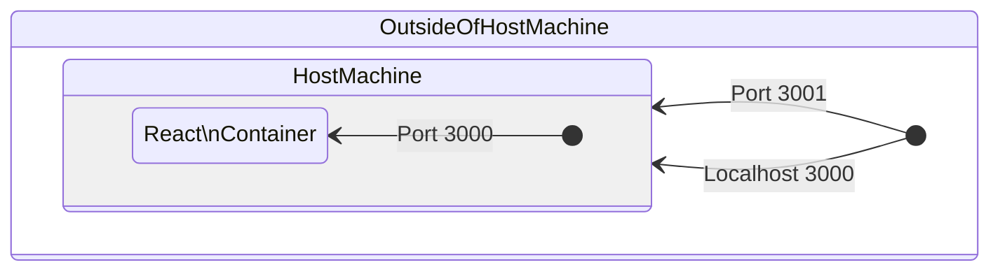
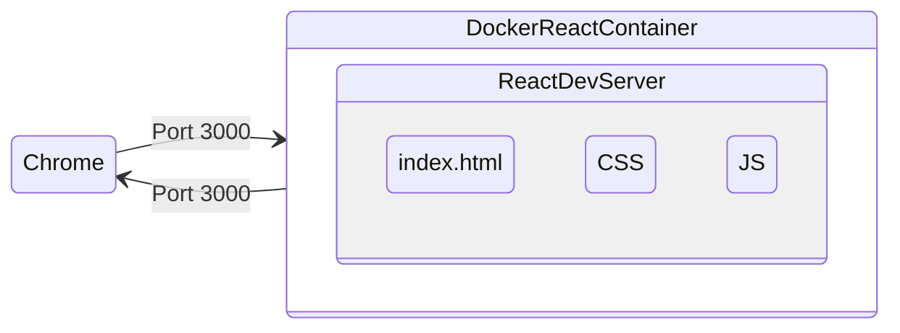
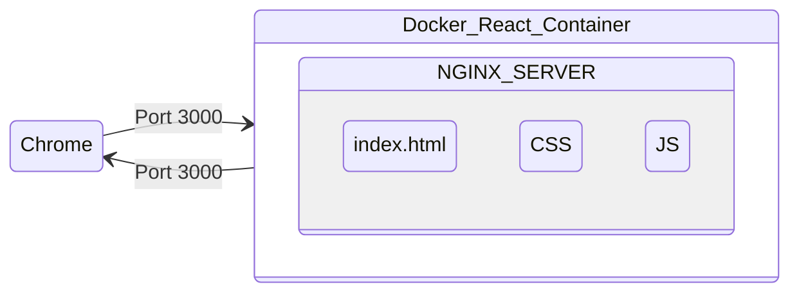
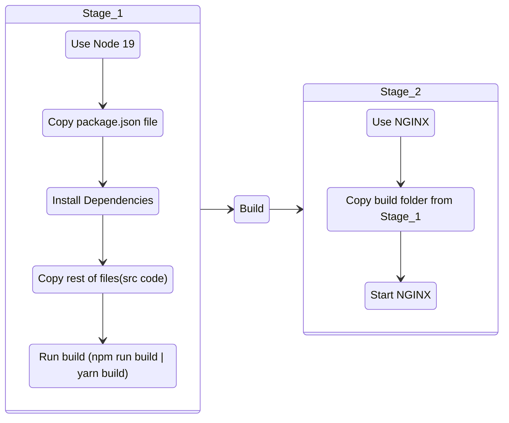

# Docker + ReactJS tutorial

> Development to Production workflow + multi-stage builds + docker compose

## Step 1. Create Dockerfile

> contain all of the steps we need to customize an image

```dockerfile
# Dockerfile
FROM node:19-alpine3.16
WORKDIR /app
COPY package.json .
RUN yarn install
COPY . .
EXPOSE 3000
CMD ["yarn", "start"]
```

```dockerfile
FROM node:19-alpine3.16
```

- we specify a node image so anytime you're customizing an image we have to give it a image that we want to customize

```dockerfile
WORKDIR /app
```

- working directory of the container
- anytime we copy any files it's going to run those commands and copy those files into this directory<br> so we know that
  anything related to our app is going to be stored in that directory
- so technically we don't need this command for anything

```dockerfile
COPY package.json .
```

- take the package.json file and copy it into the image
- right and then that way once we copy the package.json file,
- we can do an npm/yarn install to install all of our dependencies
- work directory is specified, so either `/app` or `.`

```dockerfile
RUN yarn install
```

- the next thing that we want to do is run an npm install

```dockerfile
COPY . .
```

- next thing that you want to do is now copy the rest of all of our code or the rest of all of our files into our container

### 1-1. why copy package.json again above?

- an optimization for Docker to build the image faster for future buildsk
- installing dependencies is a very expensive operation
- **each line represents a layer, so above codes represents 5 different layers**
- Docker builds these images based on these layers
- on build, Docker caches these the result of each layer
- package.json doesn't change that often unless we add a new dependency, we can cache the result of two layers,

### 1-2. `COPY package.json` . and `RUN yarn install` (the two layers)

- and then when we build the image again, Docker will use the cached result
- Docker would have no idea whether we changed our source code or we changed the dependencies in our packages.json so every time we ran a copy we would have to then do a full npm install regardless of whether or not the dependencies change so we would be unable to take the cache result
- therefore, by splitting up the COPY into two, we can ensure that only when we change our package.json, we have to run an npm install

```dockerfile
EXPOSE 3000
CMD ["yarn", "start"]
```

- The app listens on port 3000 so we want to expose port 3000 and then finally we need to do an yarn start to actually start the development server so we'll type in cmd

---

## Step 2. Build image

```bash
docker build -t react-image .
```

- outside of containers can't talk to containers by default'
- so `EXPOSE 3000` doesn't really do anything else than just exposing the port inside the container

```bash
docker run -d -p 3001:3000 --name react-app react-image
```

- `-d`: run in detached mode (run in the background)
- `-p`: port forwarding (forwarding port from the host machine to the container)
- `--name`: name of the container

- 3001: port on the host machine (poked hole for outside world)
- 3000: port on the container (what port we're going to send traffic to our container')

---

## Docker networking - forwarding ports



<br>



---

## Step 3. dockerignore files

> prevent unnecessary files from being copied into the image

Let's check the files inside the container first,

```bash
docker exec -it react-app sh # or bash if sh doesn't work

ls -a
```

- `docker exec`: run a command in a running container
- `-it`: interactive terminal
- `react-app`: container name
- `sh` or `bash`: shell (not every image is using the bash shell)

You will see a bunch of files that are unnecessary to keep inside.

Let's create .dockerignore in the root folder of your local environment.

```properties
# .dockerignore
node_modules
Dockerfile
.git
.gitignore
.dockerignore
.env
```

### 3-1. Remove the previous container, rebuild the image, and run the container

```bash
docker stop react-app
docker rm react-app # `-f` to force remove if don't skip stop

docker build -t react-image .
docker run -d -p 3001:3000 --name react-app react-image
```

### 3-2. Go to shell in the container and check if the target files are ignored properly

```bash
docker exec -it react-app sh
```

```sh
ls -a
```

Now Docker runs the container named react-appwith the image that we created. However, the local changes won't apply to the app inside the container. We're gonna look into that.

---

## Manage data in a Docker container

By default, all files created inside a container are stored on a writable container layer. This means that:

- The data doesn’t persist when that container no longer exists, and it can be difficult to get the data out of the container if another process needs it.

- A container’s writable layer is tightly coupled to the host machine where the container is running. You can’t easily move the data somewhere else.

- **Writing into a container’s writable layer requires a storage driver** to manage the filesystem. The storage driver provides a union filesystem, using the Linux kernel. This extra abstraction reduces performance as compared to using data volumes, which write directly to the host filesystem.

**Docker has two options for containers to store files on the host machine**, so that the files are persisted even after the container stops: volumes, and bind mounts.

Docker also supports containers storing files in-memory on the host machine. Such files are not persisted. If you’re running Docker on Linux, tmpfs mount is used to store files in the host’s system memory. If you’re running Docker on Windows, named pipe is used to store files in the host’s system memory.

[from Docker documentation](https://docs.docker.com/storage/)

---

## Comparisons of the three


### [Volumes](https://docs.docker.com/storage/volumes/)

> Volumes are the preferred mechanism for persisting data generated by and used by Docker containers. While bind mounts are dependent on the directory structure and OS of the host machine, volumes are completely managed by Docker.

---


### [Bind mounts](https://docs.docker.com/storage/bind-mounts/)

> Bind mounts have been around since the early days of Docker. Bind mounts have limited functionality compared to volumes. When you use a bind mount, a file or directory on the host machine is mounted into a container. The file or directory is referenced by its absolute path on the host machine.
>
> By contrast, when you use a volume, a new directory is created within Docker’s storage directory on the host machine, and Docker manages that directory’s contents.

---


### [tmpfs mounts](https://docs.docker.com/storage/tmpfs/)

> If you’re running Docker on Linux, you have a third option: tmpfs mounts. When you create a container with a tmpfs mount, the container can create files outside the container’s writable layer.
>
> As opposed to volumes and bind mounts, a tmpfs mount is temporary, and only persisted in the host memory. When the container stops, the tmpfs mount is removed, and files written there won’t be persisted.

---

### Enough with explanations, let's continue.

## Step 4. Bind mounts

> To make your local development environment communicate with the container you created, you need to use bind mounts method.

Stop container

```bash
docker rm react-app -f
```

And run the container with bind mounts

```bash
docker run -v $(pwd):/app -d -p 3001:3000 --name react-app react-image
```

- `-v`: bind mount (also can be volumes depending on the first field)

  - `-v dirlocaldirectory:containerdirectory`
  - `-v $(pwd):/app`: bind mount the current working directory to the `/app` directory in the container
  - you can only sync `src` folder

- [Official document](https://docs.docker.com/storage/bind-mounts/) recommend new users use `--mount` instead of `--volume | -v` when bind mounts because it give a way clear readability.

```bash
docker run --mount type=bind,source="$(pwd)",target=/app -d -p 3001:3000 --name react-app react-image
```

- the documentation shows **Volumes** and **Bind mounts** both use `-v` flag, only the difference is the first field:
  - for Volumes: In the case of named volumes, the first field is the name of the volume, and is unique on a given host machine. For anonymous volumes, the first field is omitted.
  - for Bind mounts: In the case of bind mounts, the first field is the path to the file or directory on the host machine.

---

### 4-1. Hot Reload

\*(update 01.26.2022) I found that HMR works without setting up CHOKIDAR_USEPOLLINGvalue. I followed the implementation right below and HMR works perfectly. Please leave a comment if it doesn't work.

To enable hot reload,<br>
add `CHOKIDAR_USEPOLLING=true` as ENV to your Dockerfile

[What is chokidar anyway?](https://www.npmjs.com/package/chokidar): Minimal and efficient cross-platform file-watching library

```dockerfile
...
...
ENV CHOKIDAR_USEPOLLING=true
COPY . .
...
```

or you can add it to your `docker run` command with `-e` flag

```bash
 docker run -e CHOKIDAR_USEPOLLING=true -v $(pwd):/app -d -p 3001:3000 --name react-app react-image
```

> \*(update 01.26.2022) I found that HMR works without setting up CHOKIDAR_USEPOLLING value on MacOS. I followed the implementation right below and HMR works perfectly. Please leave a comment if it doesn't work.

### 4-2. (important) Hot Reload issue with CRA v5.0 (I used V5.0.1)

#### [CRA 5.0 fails to hot-reload in a docker container](https://github.com/facebook/create-react-app/issues/11879#issuecomment-1072162532)

1. Create `setup.js` file in the root directory

   ```js
   // setup.js
   const fs = require('fs');
   const path = require('path');

   if (process.env.NODE_ENV === 'development') {
     const webPackConfigFile = path.resolve(
       './node_modules/react-scripts/config/webpack.config.js'
     );
     let webPackConfigFileText = fs.readFileSync(webPackConfigFile, 'utf8');

     if (!webPackConfigFileText.includes('watchOptions')) {
       if (webPackConfigFileText.includes('performance: false,')) {
         webPackConfigFileText = webPackConfigFileText.replace(
           'performance: false,',
           "performance: false,\n\t\twatchOptions: { aggregateTimeout: 200, poll: 1000, ignored: '**/node_modules', },"
         );
         fs.writeFileSync(webPackConfigFile, webPackConfigFileText, 'utf8');
       } else {
         throw new Error(`Failed to inject watchOptions`);
       }
     }
   }
   ```

   the setup.js will find the webpack.config.js file and add watchOptions to it.

2. Change `start` script in `package.json`

   ```json
   "scripts": {
    "start": "node ./setup && react-scripts start",
    ...
   },
   ```

3. Set `WDS_SOCKET_PORT` to the current port as ENV on Dockerfile

   ```properties
   ...
   ENV WDS_SOCKET_PORT=3001
   COPY . .
   ...
   ```

   or you can add it to the `docker run` command with `-e` flag

   ```bash
   docker run -e WDS_SOCKET_PORT=3001 -v $(pwd):/app -d -p 3001:3000 --name react-app react-image
   ```

   - otherwise, you'll see `WebSocketClient.js:16 WebSocket connection to 'ws://localhost:3000/ws' failed:` error on your console

4. Remove the running container and re-run it.

   ```bash
   docker rm react-app -f

   docker run -v $(pwd):/app -d -p 3001:3000 --name react-app react-image
   ```

### NOW YOU HAVE UP AND RUNNING DOCKER CONTAINER WITH HOT RELOAD

---

### 4-3. Bind Mounts Readonly

because the current setting won't stop the container write to the host machine(local machine), and this is not necessary, so we can make the bind mount readonly

```bash
# using volume flag: insert `:ro` after destination directory
docker run -e CHOKIDAR_USEPOLLING=true -v $(pwd)/src:/app/src:ro -d -p 3001:3000 --name react-app react-image
# using mount flag: add `,readonly` in type
docker run -e CHOKIDAR_USEPOLLING=true --mount type=bind,source="$(pwd)"/src,target=/app/src,readonly -d -p 3001:3000 --name react-app react-image
```

Now container can't write to the host machine.

One thing to notice is that the `readonly` has set to files inside the `src` folder. It is because if you include `node_modules`, you will see the **eslint cache error** inside the `node_modules` folder once you run `docker run` command.

```console
[eslint] EROFS: read-only file system, open '/app/node_modules/.cache/.eslintcache'
```

```sh
➜ docker exec -it react-app sh
$ cd src
$ touch hello
touch: hello: Read-only file system
```

---

## Step 5. Docker Compose

> Compose is a tool for defining and running multi-container Docker applications. With Compose, you use a YAML file to configure your application’s services. Then, with a single command, you create and start all the services from your configuration.

- as you keep working with docker some of your docker run commands will start to get even longer than this
- generally when you're working with a dockerized application you're going to have multiple containers that you need to spin up to actually do all of your testing and to do your development
- imagine having to remember five or six of these long commands for you to have to run just to bring up your development environment and then imagine having to kill all those containers one by one 😅

### 5-1. Create docker-compose.yml

```yml
# version of docker
# https://docs.docker.com/compose/compose-file/compose-file-v3/
version: '3.8'
services:
  # service represent container
  react-app:
    build: .
    ports:
      - '3001:3000'
    volumes:
      - ./src:/app/src
    environment:
      - CHOKIDAR_USEPOLLING=true # if you're on Windows
```

1. `docker-compose up` to start the container. (if you have `docker-compose.yml` file in the current directory)
2. Docker will create a network for the containers to communicate with each other.
   1. `⠿ Network practice-dockerize-react-app_default        Created`
3. Docker will create a new image for the container and the container itself.
   1. `=> exporting to image`
   2. `⠿ Container practice-dockerize-react-app-react-app_1  Created`
   3. check the image with `docker image ls`

- I found it's no longer needed to feed the `WDS_SOCKET_PORT` environment variable

When you make changes to the `Dockerfile` and rerun `docker-compose up`, Docker won't rebuild the image and just restart the container.

It because Docker only looks for a docker image with a specific name based of your project directory and the service name it has no idea if this is the latest image if this is a stale image it just looks for an image with that name and if it sees it it's not going to rebuild it

> **so you have to tell docker compose when you want to rebuild**

```bash
docker-compose up -d --build
```

### now we got a solid workflow, but this will only work for development

if you sent a couple thousand connections it would probably destroy it

---

## Step 6. Multi-stage Build for Production with NGINX

you have to change the React Dev Server to a production grade server such as NGINX Server (can be Apache)



the NGINX server will serve the static files when you run `yarn build`

what enabled this process is by having multi-stage docker builds



> [What is NGINX?](https://www.nginx.com/resources/glossary/nginx/)

### 6-1. Change current `Dockerfile` name as `Dockerfile.dev`

To create production environment, we're going to specify the current Dockerfile as `Dockerfile.dev` and create a new Dockerfile for production.

Now you need a new command to build the image using `Dockerfile.dev` on development.

```bash
docker build -f Dockerfile.dev .
```

Also the command on the `docker-compose.yml` file should be changed to

```yml
build:
  context: .
  dockerfile: Dockerfile.dev
```

### 6-2. Create `Dockerfile.prod` for production

```dockerfile
# Dockerfile.prod
# Stage 1
FROM node as build
WORKDIR /app
COPY package.json .
RUN yarn install
COPY . .
# EXPOSE 3000 - no need to expose port in prod
RUN ["yarn", "build"]

# Stage 2
FROM nginx
# from /app/build folder to the nginx folder where it serves the static files
COPY --from=build /app/build /usr/share/nginx/html
```

check out [this link](https://hub.docker.com/_/nginx) for more information about NGINX

### 6-3. Let's build the production image with `Dockerfile.prod`

```bash
docker build -f Dockerfile.prod -t react-image-prod .
```

### 6-4. Let's create a new container with the production image

```bash
docker run --env-file ./.env  -d -p 8080:80 --name react-app-prod react-image-prod
```

- no need to bind the volume because we're not going to make any changes to the production image
- the default port for NGINX is 80, and you can change `8080:80` to `80:80` or whatnot if you want

Now go to `localhost:8080` and you should see the production build of the React App

---

## Step 7. Development vs Production workflow

Let's create 3 different docker-compose files, one for development, one for production, and one for backup.

```bash
touch docker-compose.dev.yml docker-compose.prod.yml docker-compose.backup.yml
```

### 7-1. Create `docker-compose.dev.yml`

```yml
# version of docker
# https://docs.docker.com/compose/compose-file/compose-file-v3/
version: '3.8'
# service represent container
services:
  react-app:
    build:
      # either a path to a directory containing a Dockerfile, or a url to a git repository.
      context: .
      dockerfile: Dockerfile.dev
    # port mapping
    ports:
      - '3001:3000'
    # bind mount
    # volume mapping
    volumes:
      - ./src:/app/src:ro
    # environment variables
    environment:
      - WDS_SOCKET_PORT=3001
      - NODE_ENV=development
      - REACT_APP_NAME=brandonwie-dev
```

For now, let's just copy and paste the `docker-compose.dev.yml` file to `docker-compose.backup.yml`

### 7-2. Create `docker-compose.prod.yml`

```yml
# version of docker
# https://docs.docker.com/compose/compose-file/compose-file-v3/
version: '3.8'
# service represent container
services:
  react-app:
    build:
      # either a path to a directory containing a Dockerfile, or a url to a git repository.
      context: .
      dockerfile: Dockerfile.prod
    # port mapping
    ports:
      - '8080:80'
    # no bind mount
    # environment variables
    environment:
      - REACT_APP_NAME=brandonwie-prod
```

The differences between `docker-compose.dev.yml` and `docker-compose.prod.yml` are _the bind mount_, _the port mapping_, and _WDS_SOCKET_PORT environment variable_ for hot reload.

(\*important) `WDS_SOCKET_PORT` variable is only for the development, and it doesn't need to be configured if you set the TCP port(`3000`) and the Docker host port(`3001`) to be the same. I intentionally set the Docker host port to be `3001` just to show you how it actually works.

---

## About Environment Variables

### 3 ways of setting up environment Variables

> checkout [this page](https://docs.docker.com/compose/envvars-precedence/) for more for the precedence of the environment variables on Docker

1. inside `Dockerfile` - [docs link](https://docs.docker.com/engine/reference/builder/#env)

   ```dockerfile
   ENV REACT_APP_NAME=myApp
   ```

2. inside `docker-compose.yml` - [docs link](https://docs.docker.com/compose/environment-variables/#set-environment-variables-in-containers)

   ```yml
   react-app:
      # Array syntax
    environment:
      - REACT_APP_NAME=myApp
      # Map syntax
    environment:
      REACT_APP_NAME: myApp
   ```

3. in separate `.env` file, and add it inside `docker-compose.yml` - [docs link](https://docs.docker.com/compose/environment-variables/#the-env-file)

   ```properties
   REACT_APP_NAME=myApp
   ```

   ```yml
   react-app:
     env_file:
       - .env
   ```

- Environment variables in `Dockerfile` affect `docker build` and `docker run`
  - TMI: use [`--build-arg`](https://docs.docker.com/engine/reference/commandline/build/#-set-build-time-variables---build-arg) if persistence is not what you want
- Environment variables in `docker-compose` could override `docker run`
- Environment variables in `docker-compose` have precedence over `env_file`

---

### 7-3. Build image and run container using `docker-compose.dev`

```bash
 docker-compose -f docker-compose.yml -f docker-compose-dev.yml up -d --build
```

Now go to `localhost:3001` and you should see the development build of the React App

### 7-4. Build image and run container using `docker-compose.prod`

```bash
docker-compose -f docker-compose.yml -f docker-compose-prod.yml up -d --build
```

Now go to `localhost:8080` and you should see the production build of the React App

---

## Create React App Readme

This project was bootstrapped with [Create React App](https://github.com/facebook/create-react-app).
In the project directory, you can run:

### `npm start`

Runs the app in the development mode.\
Open [http://localhost:3000](http://localhost:3000) to view it in the browser.

The page will reload if you make edits.\
You will also see any lint errors in the console.

### `npm test`

Launches the test runner in the interactive watch mode.\
See the section about [running tests](https://facebook.github.io/create-react-app/docs/running-tests) for more information.

### `npm run build`

Builds the app for production to the `build` folder.\
It correctly bundles React in production mode and optimizes the build for the best performance.

The build is minified and the filenames include the hashes.\
Your app is ready to be deployed!

See the section about [deployment](https://facebook.github.io/create-react-app/docs/deployment) for more information.

### `npm run eject`

**Note: this is a one-way operation. Once you `eject`, you can’t go back!**

If you aren’t satisfied with the build tool and configuration choices, you can `eject` at any time. This command will remove the single build dependency from your project.

Instead, it will copy all the configuration files and the transitive dependencies (webpack, Babel, ESLint, etc) right into your project so you have full control over them. All of the commands except `eject` will still work, but they will point to the copied scripts so you can tweak them. At this point you’re on your own.

You don’t have to ever use `eject`. The curated feature set is suitable for small and middle deployments, and you shouldn’t feel obligated to use this feature. However we understand that this tool wouldn’t be useful if you couldn’t customize it when you are ready for it.

## Learn More

You can learn more in the [Create React App documentation](https://facebook.github.io/create-react-app/docs/getting-started).

To learn React, check out the [React documentation](https://reactjs.org/).
