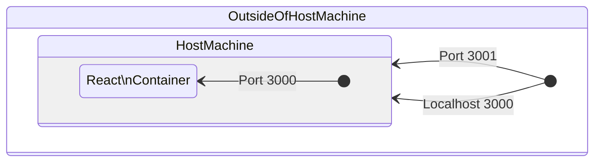
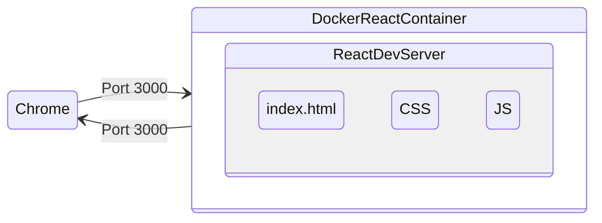

# Docker + ReactJS tutorial

> Development to Production workflow + multi-stage builds + docker compose

## Create Dockerfile

> contain all of the steps we need to customize an image

```dockerfile
# Dockerfile
FROM node:19-alpine3.16
WORKDIR /app
COPY package.json .
RUN yarn install
COPY . .
EXPOSE 3000
CMD ["yarn", "start"]
```

```dockerfile
FROM node:19-alpine3.16
```

- we specify a node image so anytime you're customizing an image we have to give it a image that we want to customize

```dockerfile
WORKDIR /app
```

- working directory of the container
- anytime we copy any files it's going to run those commands and copy those files into this directory<br> so we know that
  anything related to our app is going to be stored in that directory
- so technically we don't need this command for anything

```dockerfile
COPY package.json .
```

- take the package.json file and copy it into the image
- right and then that way once we copy the package.json file,
- we can do an npm/yarn install to install all of our dependencies
- work directory is specified, so either `/app` or `.`

```dockerfile
RUN yarn install
```

- the next thing that we want to do is run an npm install

```dockerfile
COPY . .
```

- next thing that you want to do is now copy the rest of all of our code or the rest of all of our files into our container

### why copy package.json again above?

- an optimization for Docker to build the image faster for future buildsk
- installing dependencies is a very expensive operation
- **each line represents a layer, so above codes represents 5 different layers**
- Docker builds these images based on these layers
- on build, Docker caches these the result of each layer
- package.json doesn't change that often unless we add a new dependency, we can cache the result of two layers,

### `COPY package.json` . and `RUN yarn install` (the two layers)

- and then when we build the image again, Docker will use the cached result
- Docker would have no idea whether we changed our source code or we changed the dependencies in our packages.json so every time we ran a copy we would have to then do a full npm install regardless of whether or not the dependencies change so we would be unable to take the cache result
- therefore, by splitting up the COPY into two, we can ensure that only when we change our package.json, we have to run an npm install

```dockerfile
EXPOSE 3000
CMD ["yarn", "start"]
```

- The app listens on port 3000 so we want to expose port 3000 and then finally we need to do an yarn start to actually start the development server so we'll type in cmd

---

## Build image

```bash
docker build -t react-image .
```

- outside of containers can't talk to containers by default'
- so `EXPOSE 3000` doesn't really do anything else than just exposing the port inside the container

```bash
docker run -d -p 3001:3000 --name react-app react-image
```

- `-d`: run in detached mode (run in the background)
- `-p`: port forwarding (forwarding port from the host machine to the container)
- `--name`: name of the container

- 3001: port on the host machine (poked hole for outside world)
- 3000: port on the container (what port we're going to send traffic to our container')

---

## Docker networking - forwarding ports



<br>



---

## dockerignore files

> prevent unnecessary files from being copied into the image

```bash
docker exec -it react-app sh # or bash
```

- `docker exec`: run a command in a running container
- `-it`: interactive terminal
- `react-app`: container name
- `sh` or `bash`: shell (not every image is using the bash shell)

```properties
# .dockerignore
node_modules
Dockerfile
.git
.gitignore
.dockerignore
```

### Remove previous container, rebuild image, and run container

```bash
docker stop react-app
docker rm react-app # `-f` to force remove if don't skip stop

docker build -t react-image .
docker run -d -p 3001:3000 --name react-app react-image
```

### Go to shell in the container and check if the target files are ignored properly

```bash
docker exec -it react-app sh
```

```sh
ls -a
```

---

## Bind mounts to sync src code

- the code doesn't reflect the changes in the working directory
- you have to rebuild the image every time you make a change
- it slows down the development process

### Volumes

> volumes allow you to share files between the host machine and the container <br>
> Docker containers have a concept of volumes which allow you to have persistent data

- if you have a container with any kind of data in the container if you kill the container the any data it has is lost and volumes just allow you to maintain that data even if your containers die

### Bind mounts

Stop container

```bash
docker rm react-app -f
```

And run container with bind mounts

```bash
docker run -v $(pwd):/app -d -p 3001:3000 --name react-app react-image
```

- `-v`: bind mount
  - `-v dirlocaldirectory:containerdirectory`
  - `-v $(pwd):/app`: bind mount the current working directory to the `/app` directory in the container
  - you can only sync `src` folder

---

### Hot Reload

```bash
 docker run -e CHOKIDAR_USEPOLLING=true -v $(pwd):/app -d -p 3001:3000 --name react-app react-image
```

or you can edit to your environment variable in the Dockerfile

```dockerfile
ENV CHOKIDAR_USEPOLLING=true
```

### Hot Reload issue with CRA v5.0 (I used V5.0.1)

#### [CRA 5.0 fails to hot-reload in a docker container](https://github.com/facebook/create-react-app/issues/11879#issuecomment-1072162532)

1. Create `setup.js` file in the root directory

   ```js
   // setup.js
   const fs = require('fs');
   const path = require('path');

   if (process.env.NODE_ENV === 'development') {
     const webPackConfigFile = path.resolve(
       './node_modules/react-scripts/config/webpack.config.js'
     );
     let webPackConfigFileText = fs.readFileSync(webPackConfigFile, 'utf8');

     if (!webPackConfigFileText.includes('watchOptions')) {
       if (webPackConfigFileText.includes('performance: false,')) {
         webPackConfigFileText = webPackConfigFileText.replace(
           'performance: false,',
           "performance: false,\n\t\twatchOptions: { aggregateTimeout: 200, poll: 1000, ignored: '**/node_modules', },"
         );
         fs.writeFileSync(webPackConfigFile, webPackConfigFileText, 'utf8');
       } else {
         throw new Error(`Failed to inject watchOptions`);
       }
     }
   }
   ```

2. Change `start` script in `package.json`

   ```json
   "scripts": {
    "start": "node ./setup && react-scripts start",
    ...
   },
   ```

3. Set `WDS_SOCKET_PORT` to current port on Docker

   ```properties
   # .env
   WDS_SOCKET_PORT=3001
   ```

   - otherwise, you'll see `WebSocketClient.js:16 WebSocket connection to 'ws://localhost:3001/ws' failed:` error on your console

### NOW YOU HAVE UP AND RUNNING DOCKER CONTAINER WITH HOT RELOAD

---

## Environment variables

```bash

```

---

## Create React App Readme

This project was bootstrapped with [Create React App](https://github.com/facebook/create-react-app).
In the project directory, you can run:

### `npm start`

Runs the app in the development mode.\
Open [http://localhost:3000](http://localhost:3000) to view it in the browser.

The page will reload if you make edits.\
You will also see any lint errors in the console.

### `npm test`

Launches the test runner in the interactive watch mode.\
See the section about [running tests](https://facebook.github.io/create-react-app/docs/running-tests) for more information.

### `npm run build`

Builds the app for production to the `build` folder.\
It correctly bundles React in production mode and optimizes the build for the best performance.

The build is minified and the filenames include the hashes.\
Your app is ready to be deployed!

See the section about [deployment](https://facebook.github.io/create-react-app/docs/deployment) for more information.

### `npm run eject`

**Note: this is a one-way operation. Once you `eject`, you can’t go back!**

If you aren’t satisfied with the build tool and configuration choices, you can `eject` at any time. This command will remove the single build dependency from your project.

Instead, it will copy all the configuration files and the transitive dependencies (webpack, Babel, ESLint, etc) right into your project so you have full control over them. All of the commands except `eject` will still work, but they will point to the copied scripts so you can tweak them. At this point you’re on your own.

You don’t have to ever use `eject`. The curated feature set is suitable for small and middle deployments, and you shouldn’t feel obligated to use this feature. However we understand that this tool wouldn’t be useful if you couldn’t customize it when you are ready for it.

## Learn More

You can learn more in the [Create React App documentation](https://facebook.github.io/create-react-app/docs/getting-started).

To learn React, check out the [React documentation](https://reactjs.org/).
